# Secure System Development - Lab 1

The repo link to check the files used in this assignment: [full report](https://github.com/spaghetti-cod3r/SSD-Labs/tree/main/lab1)

## Task 1 - GitLab Server

- Let's first initialize an instance on AWS and connect to it using our local machine via ssh, and then install docker and docker-compose there
- 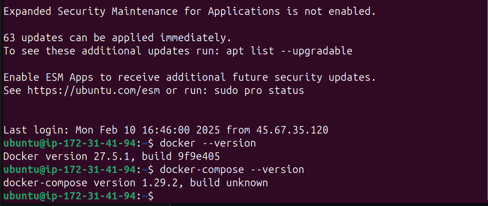
- then let's create the docker-compose file according to the requirements for the gitlab server, and build it up taking into consideration enabling https access, disabling unneeded services (registry , mattermost , gitlab-pages , gitlab-kas) and setting up volumes to keep a backup of the data (configs, logs, app data)
- 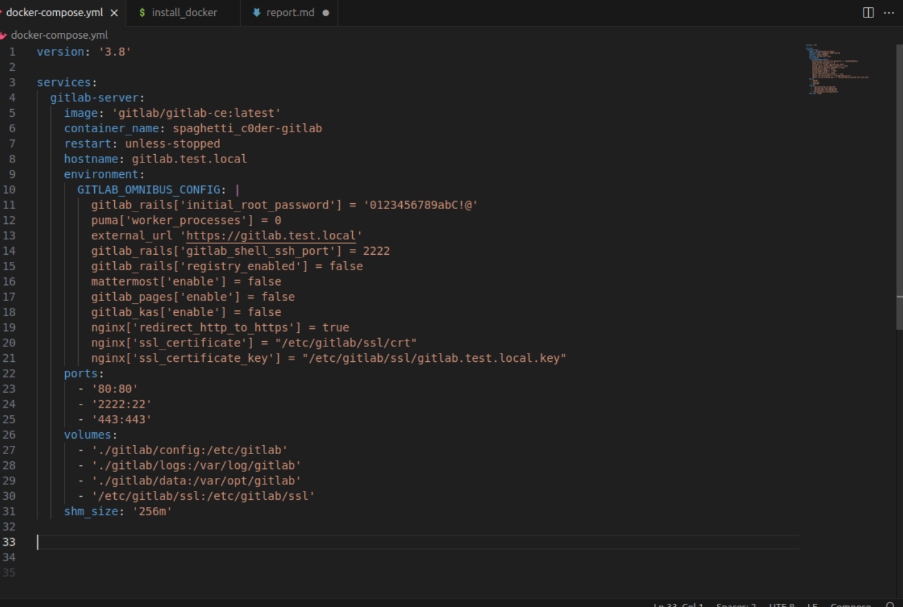
- after building the docker-compose file we can see
  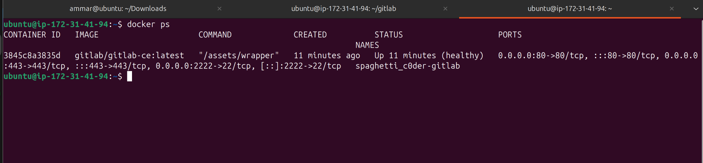
- let's now setup the certificate using `mkcert`
- 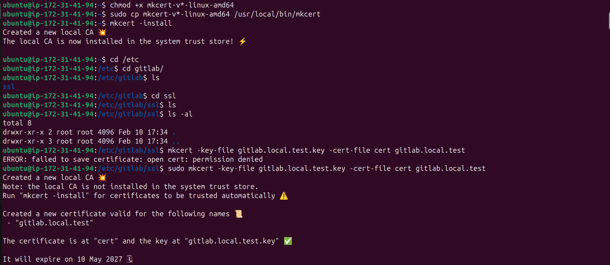
- then let's head to the browser and check the server:
- 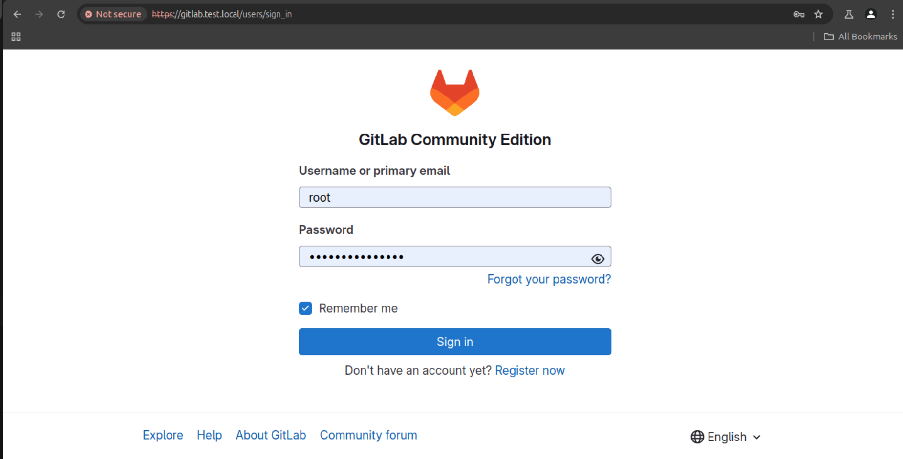
- let's log in:
  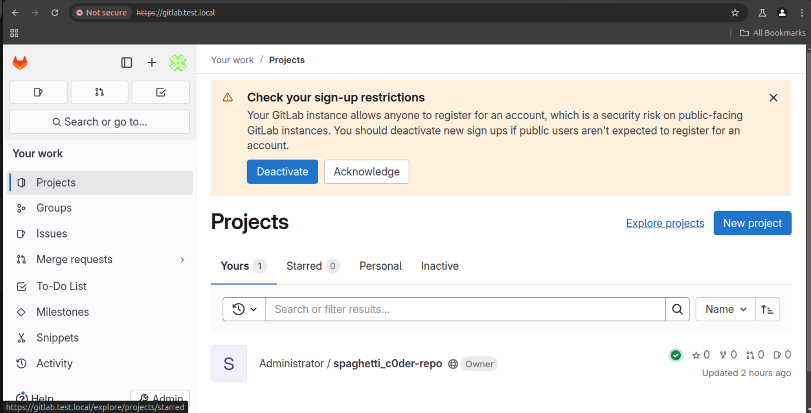
- then let's generate an ssh key to the server and copy it to the gitlab platform
- 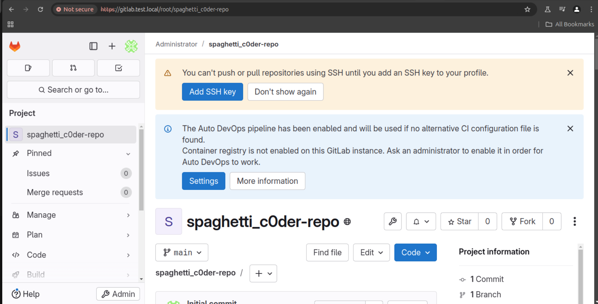
- 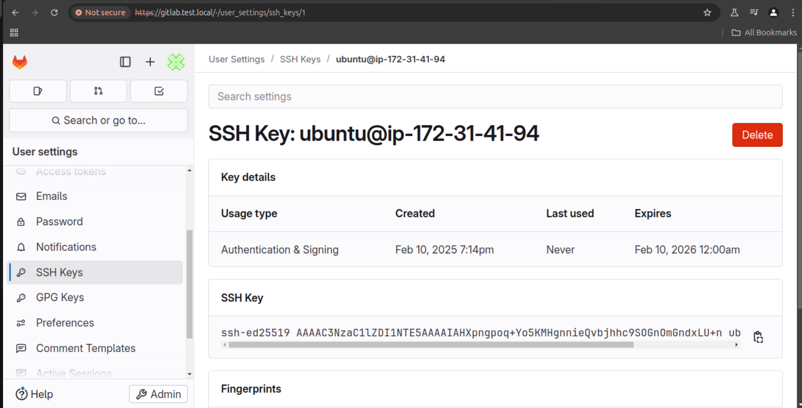

## Task 2 - GitLab Runner

- let's install gitlab-runner on the 2nd vm instance
- 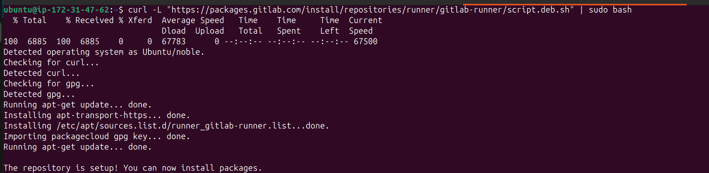
- then let's setup the certificate on the runner side by copying the certificate that we have created on the server side before, and then let's add the runner to our previous project
- 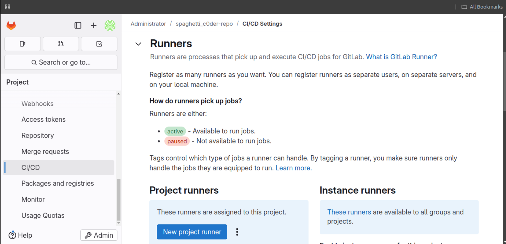
- 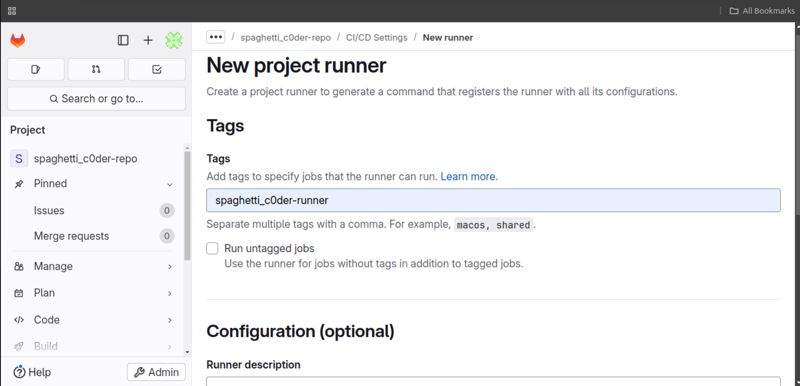
- 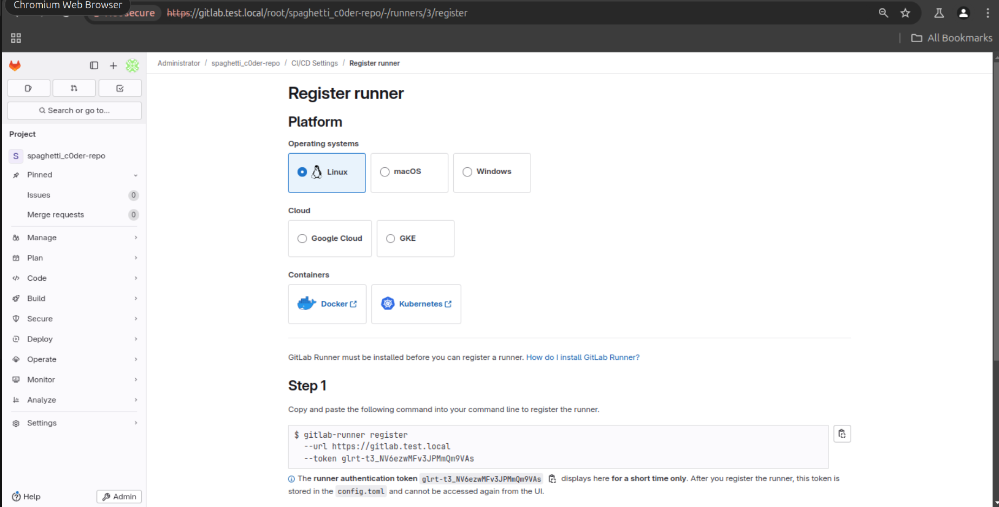
- 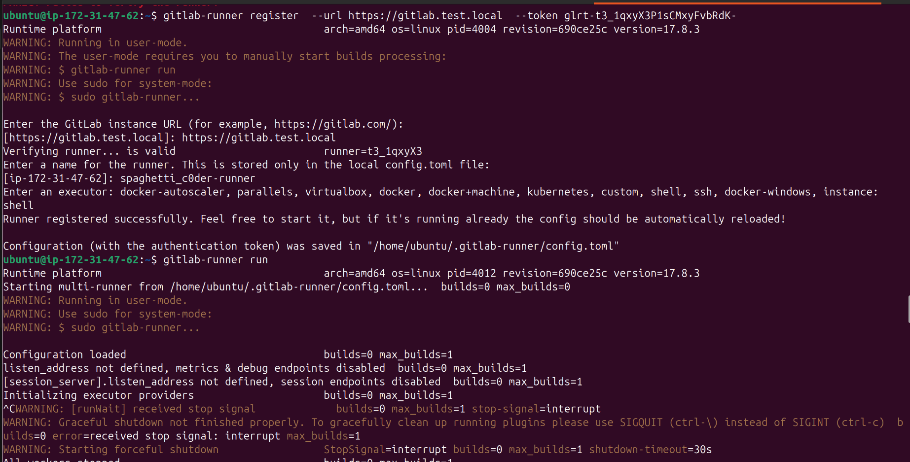
- the runner has been added successfully
- 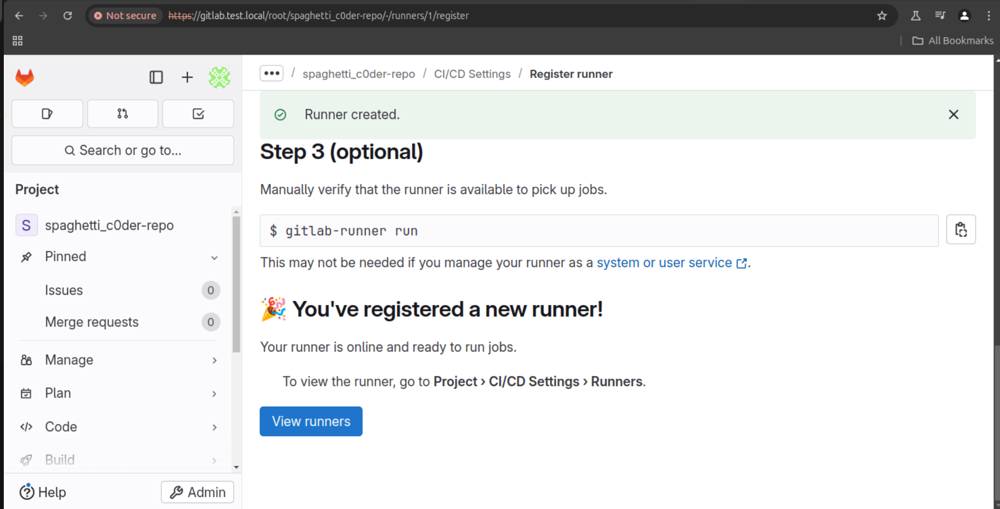

## Task 3 - GitLab SAST

- selecting the following repo as a target
- 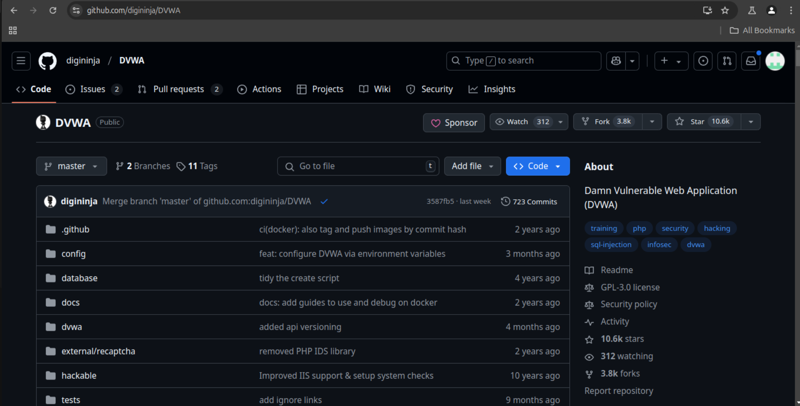
- let's clone the project, delete `.git` directory and then set the remote origin to our gitlab repo and push the project there
- 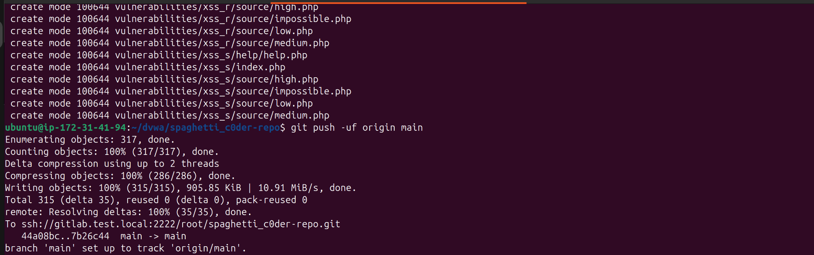
- now let's install `semgrep` on the server and create our ci pipeline and push it to our repo
- 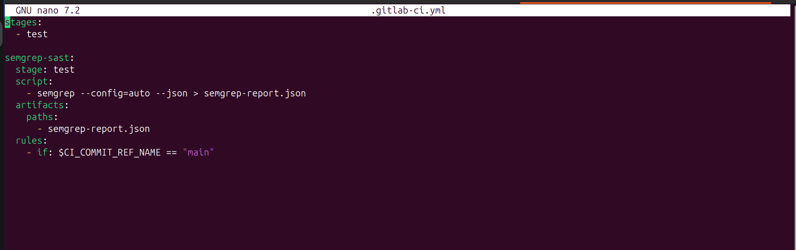
- the pipeline job has finished successfully, so let's check the artifacts
- 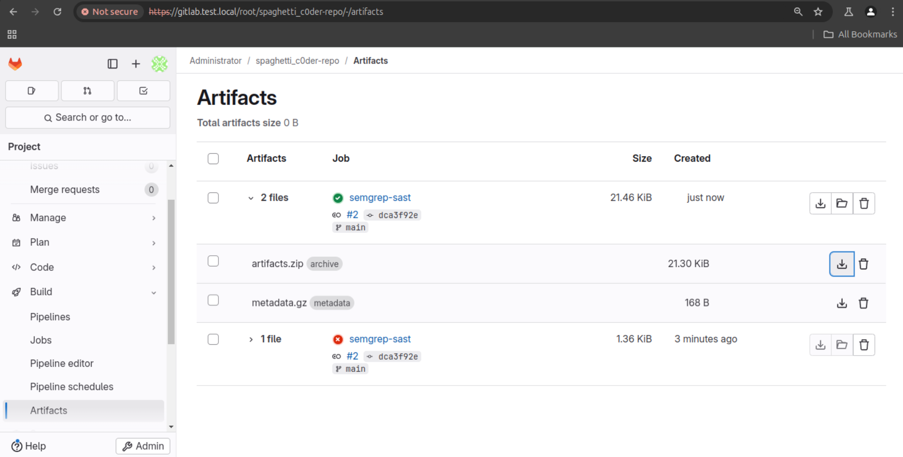
- by analyzing the json file, one of the dangerous vulnerabilits is `Command Injection (PHP)` with a **high** impact. this is because of using `shell_exec('ping ' . $target)` which allows for command injection if `$target` is user-controlled and not properly sanitized. this could allow an attacker to execute arbitrary commands on the server. and to avoid this we may:

  - avoid using functions like `shell_exec`, `exec`, or `system` with user-controlled input
  - sanitize and validate all inputs rigorously
  - use safer alternatives like parameterized commands or libraries that handle shell execution securely
