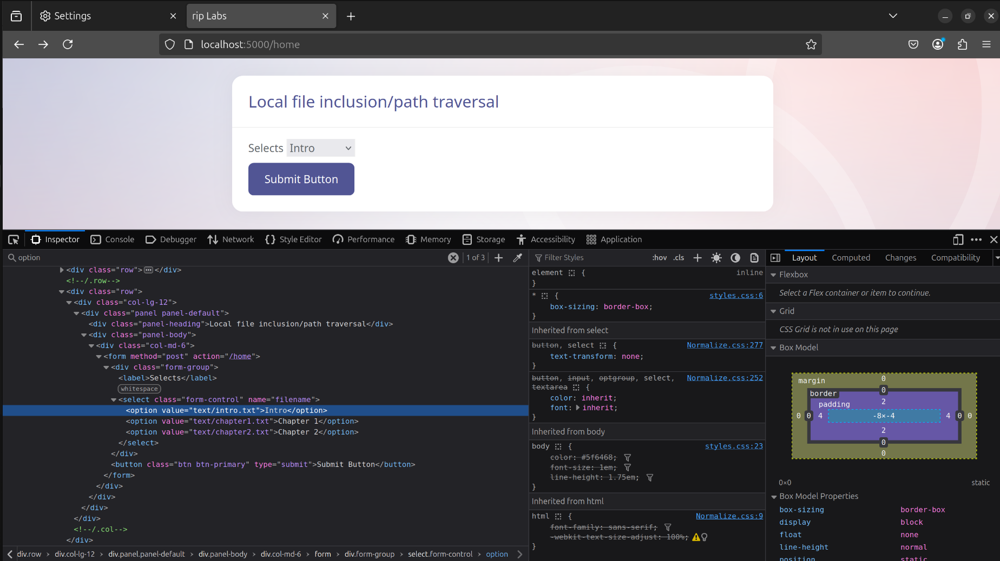

#### Ammar Meslmani - CBS-01

#### a.meslmani@innopolis.university

#### the repo link to check the files used in this assignment: [full report](https://github.com/spaghetti-cod3r/SSD-Labs/tree/main/lab2)

# Lab 2 - Vulnerability Scanning

## Task1:

- in this task, `poetry` will be used as a python virtual environment, so let's check the verion and initialize a project:
- 

### 1.1. Bandit

- let's install `bandit`:
- 
- let's clone the provided `vulpy` repo:
- 
- let's run `bandit` against the cloned repo:
- 
- findings:
  - high severity finding:

    - 
    - explanation:

      A Flask app is being run with `debug=True`, which enables the Werkzeug debugger. This exposes the app to potential security risks, as the debugger allows arbitrary code execution if an attacker gains access to it. Moreover it provides detailed error messages and stack traces, which can reveal sensitive information about the application.
    - relevant CWE:

      - CWE-94: Improper Control of Generation of Code ('Code Injection')
    - possible mitigation:

      - disable debug mode in production
  - medium severity finding:

    - 
    - explanation:

      The code uses a hardcoded temporary directory (`/tmp/ca.key`), which can lead to insecure file handling.
    - relevant CWE:

      - CWE-377: Insecure Temporary File
    - possible mitigation:

      - using Python’s tempfile module to create secure temporary files
  - low severity finding:

    - 
    - explanation:The code contains a hardcoded password or secret key (`123aa8a93bdde342c871564a62282af857bda14b3359fde95d0c5e4b321610c1`) which could be exposed to anyone with access to the codebase. Moreover, it makes it difficult to update the secret without redeploying the whole application.
    - relevant CWE:

      - CWE-259: Use of Hard-Coded Password
    - possible mitigation:

      - Useing environment variables to store secrets

### 1.2. Flawfinder (C)

- let's install `flawfinder`:
- 
- let's clone the provided repo:
- 
- let's run `flawfinder` against the cloned repo:
- 
- findings:
  - level 1:

    - 
    - explanation:
      The `strlen` function is used on a string that may not be null-terminated (\0). If the string is not null-terminated, strlen will continue reading memory beyond the intended boundary, leading to an over-read.
    - relevant CWE:
      CWE-126: Buffer Over-read
    - possible mitigation:
      Ensure that all strings passed to strlen are properly null-terminated.
  - level 2:

    - 
    - explanation:
      The `memcpy` function is used to copy data from a source to a destination buffer without checking if the destination buffer is large enough to hold the data. This can lead to a buffer overflow.
    - relevant CWE:
      CWE-120: Buffer Copy without Checking Size of Input
    - possible mitigation:
      Always validate the size of the source and destination buffers before using `memcpy`.
  - level 3:

    - no such finding was found.
- **fasle positive**:
  - considering the following finding:
  - ```
    Damn_Vulnerable_C_Program/libAFL/damn_vulnerable_c_program_shmem/imgRead.c:35:  [1] (buffer) strlen:
      Does not handle strings that are not \0-terminated; if given one it may
      perform an over-read (it could cause a crash if unprotected) (CWE-126).
    ```
  - let's check the file:
  - 
  - we can consider it as a false positive **only if** it's always guaranteed that the fuzzer will provide `null terminated strings` to `__AFL_FUZZ_TESTCASE_BUF`, which is a shared memory buffer used for fuzzing

### 1.3. njsscan

- let's install `njsscan` (after suffering with fixing versions issues and some broken packages):
- 
- let's clone the provided repo:
- 
- let's run `njsscan` against the cloned repo:
- 
- findings:
  - Error:
    - 
    - explanation:
      The <%- %> syntax in EJS directly injects data into HTML without escaping it, which makes the application vulnerable to XSS. If an attacker can manipulate `output.products[i].name` or any other variable, they could inject malicious JavaScript into the webpage.
    - relevant CWE:
      CWE-79: Improper Neutralization of Input During Web Page Generation (Cross-site Scripting).
    - possible mitigation:

      Using `<%= %>` instead of `<%- %>` to automatically escape user input.
  - Warning:
    - 
    - explanation:
      The database connection is not using TLS, making it vulnerable to Man-in-the-Middle (MITM) attacks. This means an attacker could intercept credentials and queries.
    - relevant CWE:
      CWE-319: Cleartext Transmission of Sensitive Information.
    - possible mitigation:
      Enabling TLS in the Sequelize configuration.
  - Info:
    - 
    - explanation:
      The default session configuration is used, which includes secret `keyboard cat`. Attackers can fingerprint the application and potentially hijack sessions.
    - relevant CWE:
      CWE-522: Insufficiently Protected Credentials
    - possible mitigation:
      Changing the default session secret to a strong, random value. In addition, setting `cookie: { secure: true }` to ensure cookies are only sent over HTTPS.

## Task2:

- let's install and run `burp`:
- 
- then let's install firefox and set the proxy to `127.0.0.1:8080` to interact with `burp` (becuase i use `chromium`)
- **note**: it was hell to find out that this little stupid flag `network.proxy.allow_hijacking_localhost` should be toggled to allow capturing the localhost

### Cross Site Scripting

- let's pull and run the docker image:
- 
- after some tries, let's try to insert :
- 
- XSS is found!
- why it's dangerous?
  there are a lot of reasons (like a lot!), one of them that it allows attackers to hijack cookies sessions, personal information, or login credentials
- possible mitigation:

  to prevent XSS vulnerabilities, we need to ensure that user input is properly sanitized, validated, and escaped before it is rendered in the browser

### SQL Injection

- let's pull and run the docker image:
- 
- let's try to insert a `'` in the url:
- 
- a good start! now we know that we are dealing with 3 columns
- let's try the following:
- 
- so `title` and `content` became placeholders for data
- let's try the following by trying some guesses for the users talbe (user, users, ...):
- 
- we got the usernmae and password of the admin hehe
- why it's dangerous?
  for many reasons, for example attackers can extract sensitive data such as usernames, passwords, credit card numbers, and personal information from the database
- possible mitigation:
  using parameterized queries to separate SQL code from user input, preventing attackers from injecting malicious SQL

### Path Traversal

- let's pull and run the docker image:
- 
- after we inspect the page, we can see that each option is a path for a file in the system
- 
- after modifying the first option value to `../../../../../../../../../../../etc/passwd we can see:`
- 
- why it's dangerous?
  because attackers can access sensitive files such as `/etc/passwd` (as we already did) .env, or database credentials and expose sensitive information
- possible mitigation:
  we need to ensure that user input is properly sanitized and validated before being used to access files

### File Upload

- let's pull and run the docker image:
- 
- let's try to upload a text file, and let's observe `burp`
- 
- we can see that the button is performaing a POST request, let's inspect this request
- 
- we can see that our file got uploaded on the server, but we don't know where its locaiton
- let's inspect the headers in the network tab
- 
- we can see that there is a folder called `/static`
- let's try to repeat our request but with changing the path of the file, and let's aim to upload it to `/static` folder
- 
- after many trials, we succeeded!
- let's try to access the file
- 
- why it's dangerous?
  because attackers can upload their own malicious codes and execute them on the server and cause damage or steal sensitive information, get shell access, or even perform XSS attack
- possible mitigation:
  the file types allowed to be uploaded should be restricted to only those that are necessary for business functionality. moreover, never accept a filename and its extension directly without having an allow list filter to avoid possible harm (for example, why a user should be able to upload a script to website of downloading and uploading images)

### Command Injection

- let's pull and run the docker image:
- 
- let's try to inject the following command `50; ls -la /`:
- 
- let's check the terminal (i executed it many times to check the correct syntax):
- 
- let's try to inject a command to recursively remove all files in `/static`:
- 
- 
- let's check the terminal:
- 
- baaang! we exposed the whole system structure and its files
- why it's dangerous?
  because it allows an attacker to execute arbitrary system commands on a server leading to full system compromise, data theft, and destruction of files
- possible mitigations:
  - avoiding executing system commands
  - useing parameterized Inputs
  - using secure APIs instead of shell execution
