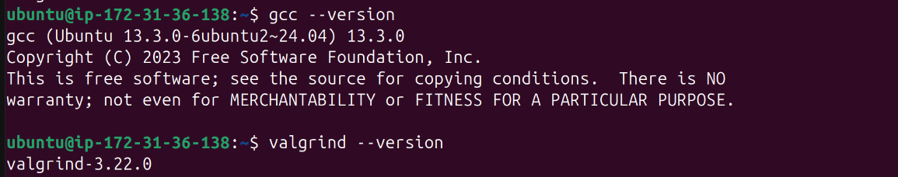
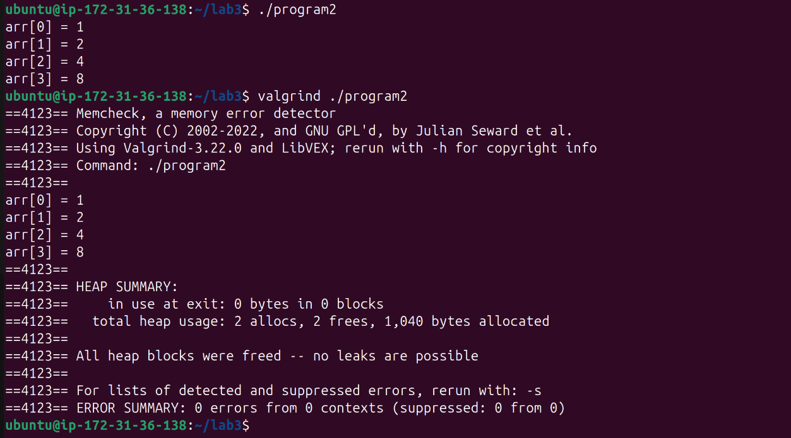

#### Ammar Meslmani - CBS-01

#### a.meslmani@innopolis.university

#### the repo link to check the files used in this assignment: [full report](https://github.com/spaghetti-cod3r/SSD-Labs/tree/main/lab2)


# Lab 3 - Memory Safety

- let's connect to a new clean ec2 instance and install `gcc` and `valgring`
- let's check versions:
- 

## Task 1

- let's create `program1.c` and compile it using

  ```
  gcc -Wall -Werror -g -std=c99 -o program1 -O0 program1.c
  ```
- explaining flags:

  - `-Wall`: enables all warnings
  - `-Werror`: considers all warnings as errors
  - `-g`: includes debugging information
  - `-std=c99`: uses C99 standards
  - `-O0`: disables optimizations
- let's run it:
- 
- let's run it again using `valgrind` by executing `valgrind ./program1`:

  ```
  ==4051== Memcheck, a memory error detector
  ==4051== Copyright (C) 2002-2022, and GNU GPL'd, by Julian Seward et al.
  ==4051== Using Valgrind-3.22.0 and LibVEX; rerun with -h for copyright info
  ==4051== Command: ./program1
  ==4051== 
  arr[0] = 0
  ==4051== Invalid write of size 4
  ==4051==    at 0x1091AC: program1 (program1.c:7)
  ==4051==    by 0x1091FE: main (program1.c:13)
  ==4051==  Address 0x4a75044 is 0 bytes after a block of size 4 alloc'd
  ==4051==    at 0x4846828: malloc (in /usr/libexec/valgrind/vgpreload_memcheck-amd64-linux.so)
  ==4051==    by 0x109184: program1 (program1.c:5)
  ==4051==    by 0x1091FE: main (program1.c:13)
  ==4051== 
  ==4051== Invalid read of size 4
  ==4051==    at 0x1091C2: program1 (program1.c:8)
  ==4051==    by 0x1091FE: main (program1.c:13)
  ==4051==  Address 0x4a75044 is 0 bytes after a block of size 4 alloc'd
  ==4051==    at 0x4846828: malloc (in /usr/libexec/valgrind/vgpreload_memcheck-amd64-linux.so)
  ==4051==    by 0x109184: program1 (program1.c:5)
  ==4051==    by 0x1091FE: main (program1.c:13)
  ==4051== 
  arr[1] = 1
  arr[2] = 4
  arr[3] = 9
  ==4051== 
  ==4051== HEAP SUMMARY:
  ==4051==     in use at exit: 4 bytes in 1 blocks
  ==4051==   total heap usage: 2 allocs, 1 frees, 1,028 bytes allocated
  ==4051== 
  ==4051== LEAK SUMMARY:
  ==4051==    definitely lost: 4 bytes in 1 blocks
  ==4051==    indirectly lost: 0 bytes in 0 blocks
  ==4051==      possibly lost: 0 bytes in 0 blocks
  ==4051==    still reachable: 0 bytes in 0 blocks
  ==4051==         suppressed: 0 bytes in 0 blocks
  ==4051== Rerun with --leak-check=full to see details of leaked memory
  ==4051== 
  ==4051== For lists of detected and suppressed errors, rerun with: -s
  ==4051== ERROR SUMMARY: 6 errors from 2 contexts (suppressed: 0 from 0)
  ```
- the previous output indicates 3 main issues

  - invalid write of size 4 (related CWE -> **CWE-787: Out-of-bounds Write**)
  - invalid read of size 4 (related CWE -> **CWE-125: Out-of-bounds Read**)
  - memory leak as 2 allocs and 1 free were detected (1 missing free) (related CWE -> **CWE-401: Missing Release of Memory after Effective Lifetime**)
- proposed fixes:

  - allocating enough memory `malloc(N * sizeof(int))`
  - using `free` at the end of the function
- the fixed code:

  ```
  #include<stdio.h>
  #include<stdlib.h>

  void program1(int N) {
      int *arr = malloc(N * sizeof(int));
      for(int i = 0; i < N; i++) {
          arr[i] = i * i;
          printf("arr[%d] = %d\n", i, arr[i]);
      }
      free(arr);
  }

  int main() {
      program1(4); // Should print the array [0, 1, 4, 9]
  }
  ```
- the program now functions correctly and the ouput of `valgrind` after applying the fixes:
- 
- the output indicates no errors, so the previous errors got fixed

## Task 2

### Program 1

- let's compile and execute `program2.c`:
- 
- let's run it again using `valgrind`:

  ```
  valgrind ./program2

  ==4088== Memcheck, a memory error detector
  ==4088== Copyright (C) 2002-2022, and GNU GPL'd, by Julian Seward et al.
  ==4088== Using Valgrind-3.22.0 and LibVEX; rerun with -h for copyright info
  ==4088== Command: ./program2
  ==4088== 
  ==4088== Invalid read of size 4
  ==4088==    at 0x10927E: program2 (program2.c:18)
  ==4088==    by 0x1092BA: main (program2.c:23)
  ==4088==  Address 0x4a75040 is 0 bytes inside a block of size 16 free'd
  ==4088==    at 0x484988F: free (in /usr/libexec/valgrind/vgpreload_memcheck-amd64-linux.so)
  ==4088==    by 0x10920A: work (program2.c:9)
  ==4088==    by 0x109260: program2 (program2.c:16)
  ==4088==    by 0x1092BA: main (program2.c:23)
  ==4088==  Block was alloc'd at
  ==4088==    at 0x4846828: malloc (in /usr/libexec/valgrind/vgpreload_memcheck-amd64-linux.so)
  ==4088==    by 0x10922B: program2 (program2.c:13)
  ==4088==    by 0x1092BA: main (program2.c:23)
  ==4088== 
  arr[0] = 1
  arr[1] = 2
  arr[2] = 4
  arr[3] = 8
  ==4088== 
  ==4088== HEAP SUMMARY:
  ==4088==     in use at exit: 0 bytes in 0 blocks
  ==4088==   total heap usage: 2 allocs, 2 frees, 1,040 bytes allocated
  ==4088== 
  ==4088== All heap blocks were freed -- no leaks are possible
  ==4088== 
  ==4088== For lists of detected and suppressed errors, rerun with: -s
  ==4088== ERROR SUMMARY: 4 errors from 1 contexts (suppressed: 0 from 0)
  ```
- the previous output indicates 1 main issue

  - invalid read of size 4, because we are attempting to access an address after it has been freed (related CWE -> **CWE-416: Use After Free**)
- proposed fixes:

  - moving `free` to the end of `program2` function
- the fixed code:

  ```
  #include<stdio.h>
  #include<stdlib.h>
  #include<string.h>

  void work(int* arr, unsigned N) {
      for(int i=1; i<N; i++) {
          arr[i] = arr[i-1] * 2;
      }
  }

  void program2(unsigned N) {
      int* arr = (int*)malloc(N * sizeof(*arr));
      memset(arr, 0, sizeof(*arr));
      arr[0] = 1;
      work(arr, N);
      for(int i=0; i<N; i++) {
          printf("arr[%d] = %d\n", i, arr[i]);
      }
      free(arr);
  }

  int main() {
      program2(4); // Should print the array [1, 2, 4, 8]
  }
  ```
- the program now functions correctly and the ouput of `valgrind` after applying the fixes:
- 
- the output indicates no errors, so the previous errors got fixed
- 

---

### Program 3

- let's compile and execute `program3.c`:
- 
- let's run it again using `valgrind`:

  ```
  valgrind ./program3

  ==4164== Memcheck, a memory error detector
  ==4164== Copyright (C) 2002-2022, and GNU GPL'd, by Julian Seward et al.
  ==4164== Using Valgrind-3.22.0 and LibVEX; rerun with -h for copyright info
  ==4164== Command: ./program3
  ==4164== 
  Memory allocation success!
  ==4164== 
  ==4164== HEAP SUMMARY:
  ==4164==     in use at exit: 4 bytes in 1 blocks
  ==4164==   total heap usage: 2 allocs, 1 frees, 1,028 bytes allocated
  ==4164== 
  ==4164== LEAK SUMMARY:
  ==4164==    definitely lost: 4 bytes in 1 blocks
  ==4164==    indirectly lost: 0 bytes in 0 blocks
  ==4164==      possibly lost: 0 bytes in 0 blocks
  ==4164==    still reachable: 0 bytes in 0 blocks
  ==4164==         suppressed: 0 bytes in 0 blocks
  ==4164== Rerun with --leak-check=full to see details of leaked memory
  ==4164== 
  ==4164== For lists of detected and suppressed errors, rerun with: -s
  ==4164== ERROR SUMMARY: 0 errors from 0 contexts (suppressed: 0 from 0)
  ```
- the previous output indicates 1 main issue

  - memory leak issue since there is a missing `free` (related CWE -> **CWE-401: Missing Release of Memory after Effective Lifetime**)
- proposed fixes:

  - fixing the condition `(arr == NULL)`, since we aim to check if the previous allocation has been succeeded rather than assigning `arr` to `NULL`
- the fixed code:

  ```
  #include<stdio.h>
  #include<stdlib.h>
  #include<string.h>

  void* program3(unsigned N) {
      void *arr = malloc(N * sizeof(*arr));
      if((N < 1) || (arr == NULL)) {
          printf("%s\n", "Memory allocation falied!");
          return NULL;
      }
      printf("%s\n", "Memory allocation success!");
      return arr;
  }

  int main() {
      int* arr = (int*)program3(4); // Should typically succeed
      free(arr);
  }
  ```
- the program now functions correctly and the ouput of `valgrind` after applying the fixes:
- 
- the output indicates no errors, so the previous errors got fixed

---

### Program 4

- let's compile and execute `program4.c`:
- 
- let's run it again using `valgrind`:
  ```
  valgrind ./program4

  ==4195== Memcheck, a memory error detector
  ==4195== Copyright (C) 2002-2022, and GNU GPL'd, by Julian Seward et al.
  ==4195== Using Valgrind-3.22.0 and LibVEX; rerun with -h for copyright info
  ==4195== Command: ./program4
  ==4195== 
  ==4195== Conditional jump or move depends on uninitialised value(s)
  ==4195==    at 0x484F229: strlen (in /usr/libexec/valgrind/vgpreload_memcheck-amd64-linux.so)
  ==4195==    by 0x48CADA7: __printf_buffer (vfprintf-process-arg.c:435)
  ==4195==    by 0x48CB73A: __vfprintf_internal (vfprintf-internal.c:1544)
  ==4195==    by 0x48C01B2: printf (printf.c:33)
  ==4195==    by 0x10923C: program4 (program4.c:12)
  ==4195==    by 0x109251: main (program4.c:16)
  ==4195== 
  ==4195== Conditional jump or move depends on uninitialised value(s)
  ==4195==    at 0x484F238: strlen (in /usr/libexec/valgrind/vgpreload_memcheck-amd64-linux.so)
  ==4195==    by 0x48CADA7: __printf_buffer (vfprintf-process-arg.c:435)
  ==4195==    by 0x48CB73A: __vfprintf_internal (vfprintf-internal.c:1544)
  ==4195==    by 0x48C01B2: printf (printf.c:33)
  ==4195==    by 0x10923C: program4 (program4.c:12)
  ==4195==    by 0x109251: main (program4.c:16)
  ==4195== 
  ==4195== Conditional jump or move depends on uninitialised value(s)
  ==4195==    at 0x48F2E59: _IO_file_overflow@@GLIBC_2.2.5 (fileops.c:783)
  ==4195==    by 0x48F5678: _IO_default_xsputn (genops.c:399)
  ==4195==    by 0x48F5678: _IO_default_xsputn (genops.c:370)
  ==4195==    by 0x48F3AE9: _IO_new_file_xsputn (fileops.c:1265)
  ==4195==    by 0x48F3AE9: _IO_file_xsputn@@GLIBC_2.2.5 (fileops.c:1197)
  ==4195==    by 0x48C0CC8: __printf_buffer_flush_to_file (printf_buffer_to_file.c:59)
  ==4195==    by 0x48C0CC8: __printf_buffer_to_file_done (printf_buffer_to_file.c:120)
  ==4195==    by 0x48CB742: __vfprintf_internal (vfprintf-internal.c:1545)
  ==4195==    by 0x48C01B2: printf (printf.c:33)
  ==4195==    by 0x10923C: program4 (program4.c:12)
  ==4195==    by 0x109251: main (program4.c:16)
  ==4195== 
  ==4195== Syscall param write(buf) points to uninitialised byte(s)
  ==4195==    at 0x497C574: write (write.c:26)
  ==4195==    by 0x48F3974: _IO_file_write@@GLIBC_2.2.5 (fileops.c:1181)
  ==4195==    by 0x48F2570: new_do_write (fileops.c:449)
  ==4195==    by 0x48F2570: _IO_do_write@@GLIBC_2.2.5 (fileops.c:426)
  ==4195==    by 0x48F2EF2: _IO_file_overflow@@GLIBC_2.2.5 (fileops.c:784)
  ==4195==    by 0x48F5678: _IO_default_xsputn (genops.c:399)
  ==4195==    by 0x48F5678: _IO_default_xsputn (genops.c:370)
  ==4195==    by 0x48F3AE9: _IO_new_file_xsputn (fileops.c:1265)
  ==4195==    by 0x48F3AE9: _IO_file_xsputn@@GLIBC_2.2.5 (fileops.c:1197)
  ==4195==    by 0x48C0CC8: __printf_buffer_flush_to_file (printf_buffer_to_file.c:59)
  ==4195==    by 0x48C0CC8: __printf_buffer_to_file_done (printf_buffer_to_file.c:120)
  ==4195==    by 0x48CB742: __vfprintf_internal (vfprintf-internal.c:1545)
  ==4195==    by 0x48C01B2: printf (printf.c:33)
  ==4195==    by 0x10923C: program4 (program4.c:12)
  ==4195==    by 0x109251: main (program4.c:16)
  ==4195==  Address 0x4a75048 is 8 bytes inside a block of size 1,024 alloc'd
  ==4195==    at 0x4846828: malloc (in /usr/libexec/valgrind/vgpreload_memcheck-amd64-linux.so)
  ==4195==    by 0x48E51B4: _IO_file_doallocate (filedoalloc.c:101)
  ==4195==    by 0x48F5523: _IO_doallocbuf (genops.c:347)
  ==4195==    by 0x48F2F8F: _IO_file_overflow@@GLIBC_2.2.5 (fileops.c:745)
  ==4195==    by 0x48F3AAE: _IO_new_file_xsputn (fileops.c:1244)
  ==4195==    by 0x48F3AAE: _IO_file_xsputn@@GLIBC_2.2.5 (fileops.c:1197)
  ==4195==    by 0x48C0CC8: __printf_buffer_flush_to_file (printf_buffer_to_file.c:59)
  ==4195==    by 0x48C0CC8: __printf_buffer_to_file_done (printf_buffer_to_file.c:120)
  ==4195==    by 0x48CB742: __vfprintf_internal (vfprintf-internal.c:1545)
  ==4195==    by 0x48C01B2: printf (printf.c:33)
  ==4195==    by 0x10923C: program4 (program4.c:12)
  ==4195==    by 0x109251: main (program4.c:16)
  ==4195== 
  String: Hello World!
  ==4195== 
  ==4195== HEAP SUMMARY:
  ==4195==     in use at exit: 0 bytes in 0 blocks
  ==4195==   total heap usage: 1 allocs, 1 frees, 1,024 bytes allocated
  ==4195== 
  ==4195== All heap blocks were freed -- no leaks are possible
  ==4195== 
  ==4195== Use --track-origins=yes to see where uninitialised values come from
  ==4195== For lists of detected and suppressed errors, rerun with: -s
  ==4195== ERROR SUMMARY: 26 errors from 4 contexts (suppressed: 0 from 0)
  ```
- the previous output indicates 1 main issue
  - using an uninitialized memory, since `message` is getting freed after `getString` gets finished, but that address is getting accessed in `program4` function (related CWE -> **CWE-457: Use of Uninitialized Variable**)
- proposed fixes:
  - moving `free` to the end of `program2` function
- the fixed code:
  ```
  #include<stdio.h>
  #include<stdlib.h>
  #include<string.h>

  #define BUFFER_SIZE 100

  char* getString() {
      char *mem = (char *)malloc(BUFFER_SIZE * sizeof(char));

      char message[BUFFER_SIZE] = "Hello World!";

      strncpy(mem, message, BUFFER_SIZE - 1);
      mem[BUFFER_SIZE - 1] = '\0'; // just for extra assurance

      char* ret = mem;
      return ret;
  }

  void program4() {
      char *res = getString();
      printf("String: %s\n", res);
      free(res);
  }

  int main() {
      program4();
  }
  ```
- the program now functions correctly and the ouput of `valgrind` after applying the fixes:
- 
- the output indicates no errors, so the previous errors got fixed

## Task 3

- potenctioal CWEs:
  - **CWE-457: Use of Uninitialized Variable**

    - in `HashIndex` funciton we have

      ```
      int sum;
      ```

      which is a local variable with a garbage memory
  - **CWE-758: Reliance on Undefined, Unspecified, or Implementation-Defined Behavior**

    - in `HashIndex` funciton we have

      ```
      for (char* c = key; c; c++) {
          sum += *c;
      }
      ```

      where the condition of the loop checks whether the pointer `c` is `NULL` rather checking that its value is `\0`
  - **CWE-190: Integer Overflow or Wraparound,** **CWE-682: Incorrect Calculation**, and **CWE-125: Out-of-bounds Read**

    - in `HashIndex` funciton we have

      ```
      for (char* c = key; c; c++) {
          sum += *c;
      }
      ```

      where we are increasing the value of `sum` without checking whether this is causing an `overflow`, and we are not applying the modulo operation which causes `incorrect calculation` for hashing, and at the same time this will cause `out of bound` issue as we may go out of the hash array bounds
  - **CWE-134: Use of Externally-Controlled Format String** and **CWE-123: Write-what-where Condition**

    - in `HashDump` function we have

      ```
      printf(val->KeyName);
      ```

      we are not specifying the string format by ourselves, which gives this opportunity to the user, which in turn can cause troubles if he manages to exploit it, because this may allow him to write arbitrary data to arbitrary memory locations, cause buffer overread, crash the program, or even worse
  - **CWE-462: Duplicate Key in Associative List (Alist)**

    - in `HashAdd` function, we are not checking whether the key already exist, which will cause duplicates keys, and `ValueCount` variable will be just useless

      ```
      void HashAdd(HashMap *map, PairValue *value) {
          int idx = HashIndex(value->KeyName);
          if (map->data[idx]) 
              value->Next = map->data[idx]->Next;

          map->data[idx] = value;
      }
      ```
- let's apply fixes to the issues mentioned above
  - ```
    int sum;
    ```
  - ```
    for (char* c = key; *c != '\0'; c++) {
    ```
  - ```
    sum += *c;
    ```
  - ```
    printf("%s %u\n", val->KeyName, val->ValueCount);
    ```
  - ```
    void HashAdd(HashMap *map, PairValue *value) {
        if (map == NULL || value == NULL) {
            return; // Handle invalid input
        }

        // check whether the key is already present
        PairValue* exist = HashFind(map, value->KeyName);
        if (exist) {
            exist->ValueCount++;
            return;
        }

        // doesn't exist
        int idx = HashIndex(value->KeyName);
        value->Next = map->data[idx]; // insert at the head since it's faster than inserting at the end
        map->data[idx] = value;
    }
    ```
  - also `HashDump` was edited to print the key-value pair of each entry
  - there were more minor issues which got solved, and they can be found in the corrected shared codes
- let's compile and run:
- 
- now let's run using `valgrind`:
- 
- everything went good!
