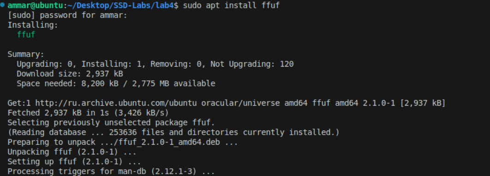
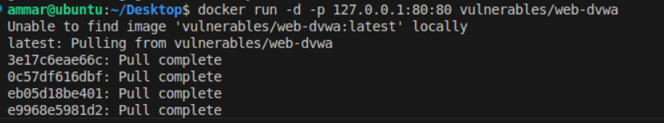
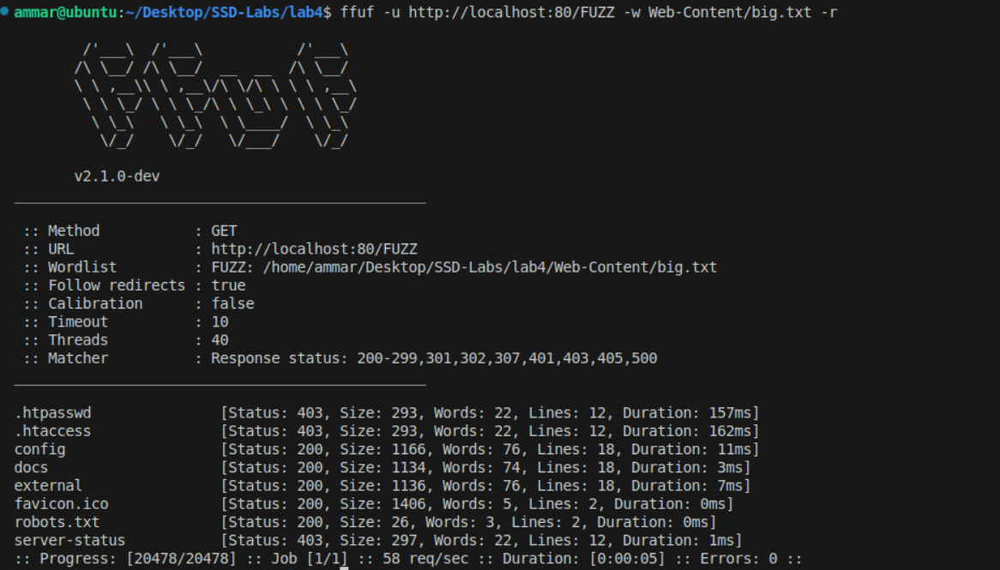
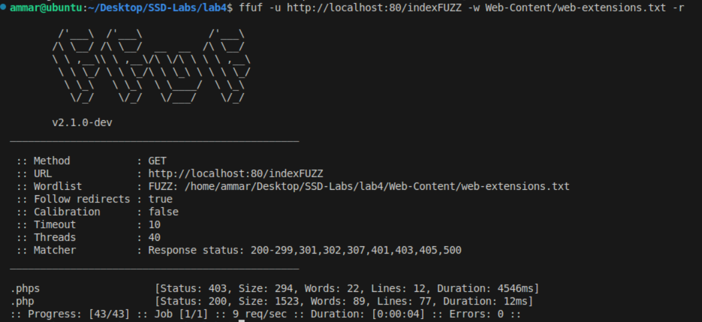
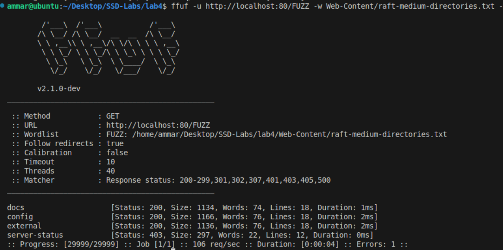
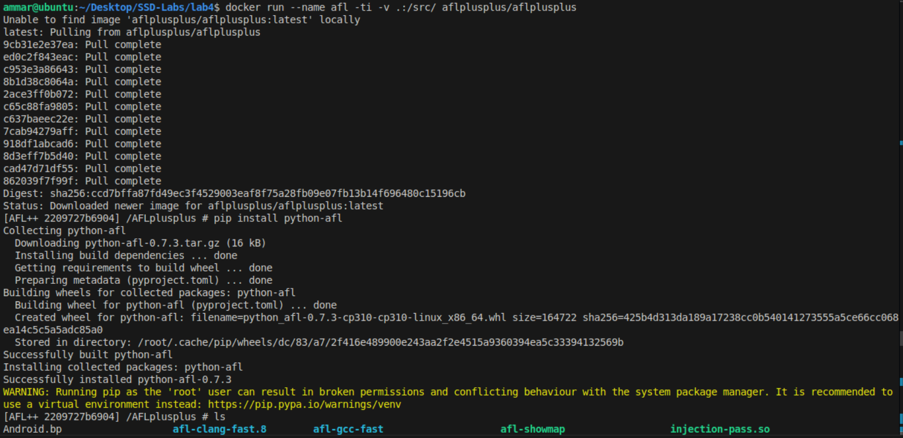
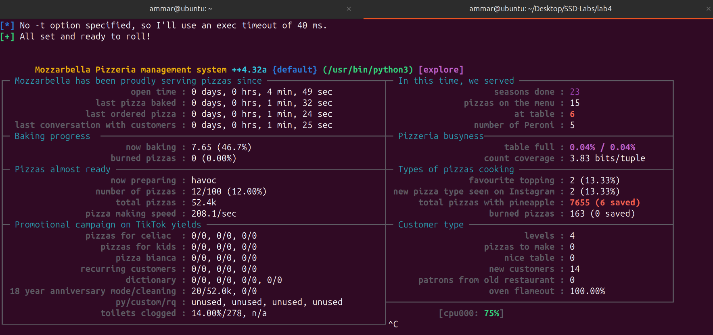
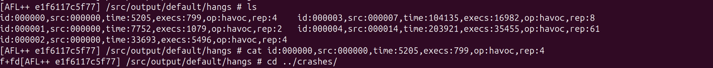
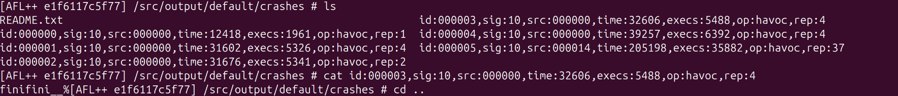

# Ammar Meslmani - CBS-01

#### a.meslmani@innopolis.university

#### the repo link to check the files used in this assignment: [full report](https://github.com/spaghetti-cod3r/SSD-Labs/tree/main/lab4)

# Lab 4

## Task 1

- let's install `ffuf`
- 
- let's run `DVWA` locally
- 
- let's run: `ffuf -u http://localhost:80/FUZZ -w Web-Content/big.txt -r`
  - **`-u http://localhost:80/FUZZ`** : target URL with `FUZZ` as a placeholder for wordlist entries
  - **`-w Web-Content/big.txt`** : uses `big.txt` as input for `FUZZ`
  - `-r`: follows HTTP redirects
- which endpoints/files from big.txt were accessible?
  - 
  - according to the result of the command, `favicon.ico` and `robots.txt` files and `external`, `docs`, and `config` directories
- which ones gave interesting error codes (not 404)?
  - 403: `.htaccess`, `.thpasswd`, and `server-status`, which indicates that this file exists, but it's forbidden to be accessed
- now let's run: `ffuf -u http://localhost:80/FUZZ -w Web-Content/big.txt -r`
  - `-u http://localhost:80/indexFUZZ `: targets `index` files with dynamic extensions
  - **`-w Web-Content/web-extensions.txt`** : wordlist containing extensions
  - `-r`: follows HTTP redirects
- what file extensions from web-extensions.txt are available for the index page?
  - 
  - according to the result of the command, `.php` (redirection) and `.phps` (forbidden)
- now let's run `fuf -u http://localhost:80/FUZZ -w Web-Content/raft-medium-directories.txt -r`
  - `-u http://localhost:80/FUZZ`: `FUZZ` is a placeholder where **ffuf** inserts entries from the wordlist
  - **`-w Web-Content/raft-medium-directories.txt`** : uses `raft-medium-directories.txt` (a curated list of common dirs) for `FUZZ`
  - `-r`: follows HTTP redirects
- which directories from raft-medium-directories.txt are accessible?
  - 
  - according to the result of the command, `external`, `docs`, and `config` directories
- which ones gave interesting error codes (not 404)?
  - 403: `server-status`, which indicates that this directory exists, but it's forbidden to be accessed

## Task 2

- let's install AFL++ locally using the docker image:
- 
- let's prepare `input.txt` file:

  ```
  finish_him
  ```
- let's run the fuzzer using `py-afl-fuzz -i input -o output -- /usr/bin/python3 main.py`
- 
- let's inspect `fuzzer_stats` file:

  ```
  [AFL++ e1f6117c5f77] /src/output/default # cat fuzzer_stats 
  start_time        : 1743538971
  last_update       : 1743539261
  run_time          : 289
  fuzzer_pid        : 154504
  cycles_done       : 23
  cycles_wo_finds   : 9
  time_wo_finds     : 92
  fuzz_time         : 287
  calibration_time  : 0
  cmplog_time       : 0
  sync_time         : 0
  trim_time         : 1
  execs_done        : 52407
  execs_per_sec     : 180.87
  execs_ps_last_min : 192.13
  corpus_count      : 15
  corpus_favored    : 2
  corpus_found      : 14
  corpus_imported   : 0
  corpus_variable   : 0
  max_depth         : 4
  cur_item          : 7
  pending_favs      : 0
  pending_total     : 0
  stability         : 100.00%
  bitmap_cvg        : 0.04%
  saved_crashes     : 6
  saved_hangs       : 5
  total_tmout       : 163
  last_find         : 1743539168
  last_crash        : 1743539177
  last_hang         : 1743539175
  execs_since_crash : 16525
  exec_timeout      : 40
  slowest_exec_ms   : 0
  peak_rss_mb       : 0
  cpu_affinity      : 0
  edges_found       : 23
  total_edges       : 65536
  var_byte_count    : 0
  havoc_expansion   : 5
  auto_dict_entries : 0
  testcache_size    : 820
  testcache_count   : 15
  testcache_evict   : 0
  afl_banner        : /usr/bin/python3
  afl_version       : ++4.32a
  target_mode       : shmem_testcase default
  command_line      : afl-fuzz -i input/ -o output -- /usr/bin/python3 main.py
  ```
- let's inspect one  `crash` and one `hang` cases

  - `hang`: f+fd
  - 
  - problem: the loop gets stuck because `i` isn’t incremented when `s[i] == '+'` and this causes an infinite loop on the `+` character
  - fix: increase `i` in the elif block
  - `crash`: finifini__%
  - 
  - problem: the code crashes when `%` is at the end of the string because it tries to access `s[i+1]` and `s[i+2]` (out-of-bounds)
  - fix: check if `%` has 2 valid digits after it
- Will the fuzzer ever terminate in the above experiment? Why/Why not?

  no, because the mutation will never end (it's a continuous process)
- How coverage-guided fuzzers work? Is AFL coverage-guided?

  they track which code paths are executed by mutations and  prioritize inputs that explore new branches. yes, AFL is coverage-guided as it mutates inputs to maximize code coverage and find crashes
- How to optimize a fuzzing campaign?

  increase the quality of the seed which we start with and paralellize the fuzzing process
