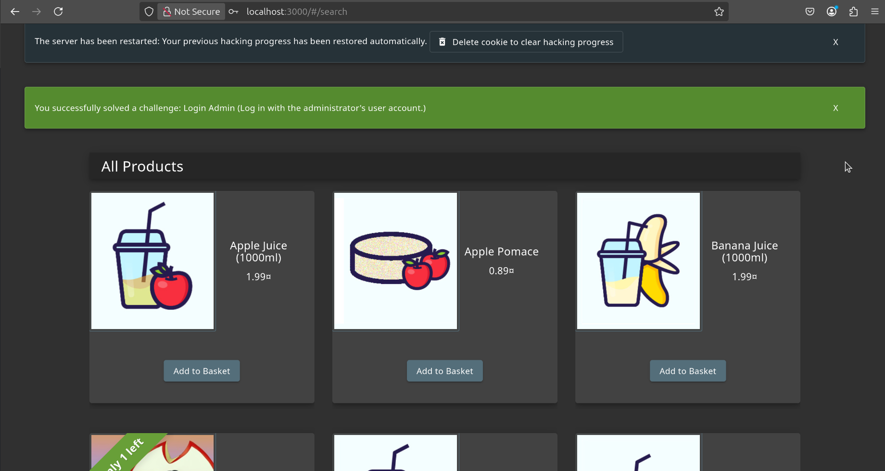

#### Ammar Meslmani - CBS-01

#### a.meslmani@innopolis.university

#### the repo link to check the files used in this assignment: [full report](https://github.com/spaghetti-cod3r/SSD-Labs/tree/main/lab5)

# Lab 5

## Task 1

- let's pull the docker image and run it on port 3000
- 
- let's log in as **admin** using **SQL Injection**
- 
- 
- now let's create `docker-compose` file to run `waf` on top of the juice shop

  ```
  services:
    app:
      container_name: jucie-shop
      image: bkimminich/juice-shop 
      networks:
        - appnet

    waf:
      container_name: web-application-firewall
      image: owasp/modsecurity-crs:nginx
      environment:
        - BACKEND=http://app:3000
      ports:
        - "9000:8080"
      networks:
        - appnet

  networks:
    appnet:
      driver: bridge
  ```
- **note**: port 9000 was used for `waf` because port 8080 is reserved by another service
- now let's try again to log in as admin
- 
- `waf` prevented us from `SQL-Injection` attack!

## Task 2

- let's try another pattern to bypass `waf` by exploiting `SQL-Injection`
- 
- let's add a custom rule to prevent this pattern (a regex to reject the `\` and `'` characters since they are not valid for emails)
- `custom-rule.conf` file was created:

  ```
  SecRule ARGS|REQUEST_HEADERS "@rx ^\\'" \
      "id:999903,\
      phase:2,\
      deny,\
      capture,\
      t:none,t:urlDecodeUni,\
      msg:'Blocking input starting with backslash and single quote',\
      logdata:'Matched Data: %{TX.0} found',\
      tag:'application-multi',\
      tag:'security',\
      tag:'sql-injection',\
      ver:'OWASP_CRS/4.13.0',\
      severity:'CRITICAL',\
      setvar:'tx.inbound_anomaly_score_pl1=+%{tx.critical_anomaly_score}'"
  ```
- and then it got mounted to the `waf` image through `docker-compose.yml` file

  ```
  services:
    app:
      container_name: jucie-shop
      image: bkimminich/juice-shop 
      ports:
        - "3000:3000"
      networks:
        - appnet

    waf:
      container_name: web-application-firewall
      image: owasp/modsecurity-crs:nginx
      volumes:
        - ./custom_rules/custom-rule.conf:/etc/modsecurity.d/owasp-crs/rules/custom-rule.conf
      environment:
        - BACKEND=http://app:3000
      ports:
        - "9000:8080"
      networks:
        - appnet

  networks:
    appnet:
      driver: bridge

  ```
- after restarting the docker image, and attempting to bypass the waf again using the previous pattern used we get:
- 
- now let's run `sqlmap` to test if the `waf` is injectable
- 
- final results:
- 
- full report:
- ```
  python3 sqlmap.py -u "http://localhost:9000/rest/products/search?q=test" \
    --batch \
    --risk=3 \
    --level=5 \
    --dbms=sqlite \
    --tamper=between,space2comment,unmagicquotes \
    --random-agent \
    --timeout=5 \
    --time-sec=1 \
    --delay=0 \
    --flush-session \
    --fresh-queries \
    --keep-alive \
    --null-connection \
    --predict-output
          ___
         __H__
   ___ ___[.]_____ ___ ___  {1.9.4.1#dev}
  |_ -| . [']     | .'| . |
  |___|_  [(]_|_|_|__,|  _|
        |_|V...       |_|   https://sqlmap.org

  [!] legal disclaimer: Usage of sqlmap for attacking targets without prior mutual consent is illegal. It is the end user's responsibility to obey all applicable local, state and federal laws. Developers assume no liability and are not responsible for any misuse or damage caused by this program

  [*] starting @ 17:59:51 /2025-04-11/

  [17:59:51] [INFO] loading tamper module 'between'
  [17:59:51] [INFO] loading tamper module 'space2comment'
  [17:59:51] [INFO] loading tamper module 'unmagicquotes'
  it appears that you might have mixed the order of tamper scripts. Do you want to auto resolve this? [Y/n/q] Y
  [17:59:51] [INFO] fetched random HTTP User-Agent header value 'Mozilla/5.0 (X11; U; Linux i686; en-US; rv:1.8.1.16) Gecko/20080715 Firefox/2.0.0.16' from file '/home/ammar/Desktop/SSD-Labs/lab5/sqlmap/data/txt/user-agents.txt'
  [17:59:51] [INFO] testing connection to the target URL
  [17:59:51] [INFO] checking if the target is protected by some kind of WAF/IPS
  [17:59:51] [CRITICAL] heuristics detected that the target is protected by some kind of WAF/IPS
  are you sure that you want to continue with further target testing? [Y/n] Y
  [17:59:51] [INFO] testing NULL connection to the target URL
  [17:59:51] [INFO] NULL connection is supported with HEAD method ('Content-Length')
  [17:59:51] [INFO] testing if the target URL content is stable
  [17:59:52] [INFO] target URL content is stable
  [17:59:52] [INFO] testing if GET parameter 'q' is dynamic
  [17:59:52] [INFO] GET parameter 'q' appears to be dynamic
  [17:59:52] [WARNING] heuristic (basic) test shows that GET parameter 'q' might not be injectable
  [17:59:52] [INFO] testing for SQL injection on GET parameter 'q'
  [17:59:52] [INFO] testing 'AND boolean-based blind - WHERE or HAVING clause'
  [17:59:53] [INFO] testing 'OR boolean-based blind - WHERE or HAVING clause'
  [17:59:53] [INFO] testing 'OR boolean-based blind - WHERE or HAVING clause (NOT)'
  [17:59:54] [INFO] testing 'AND boolean-based blind - WHERE or HAVING clause (subquery - comment)'
  [17:59:55] [INFO] testing 'OR boolean-based blind - WHERE or HAVING clause (subquery - comment)'
  [17:59:55] [INFO] testing 'AND boolean-based blind - WHERE or HAVING clause (comment)'
  [17:59:55] [INFO] testing 'OR boolean-based blind - WHERE or HAVING clause (comment)'
  [17:59:55] [INFO] testing 'OR boolean-based blind - WHERE or HAVING clause (NOT - comment)'
  [17:59:55] [INFO] testing 'Boolean-based blind - Parameter replace (original value)'
  [17:59:55] [INFO] testing 'Boolean-based blind - Parameter replace (DUAL)'
  [17:59:55] [INFO] testing 'Boolean-based blind - Parameter replace (DUAL - original value)'
  [17:59:55] [INFO] testing 'Boolean-based blind - Parameter replace (CASE)'
  [17:59:55] [INFO] testing 'Boolean-based blind - Parameter replace (CASE - original value)'
  [17:59:56] [INFO] testing 'HAVING boolean-based blind - WHERE, GROUP BY clause'
  [17:59:56] [INFO] testing 'Generic inline queries'
  [17:59:56] [INFO] testing 'SQLite AND boolean-based blind - WHERE, HAVING, GROUP BY or HAVING clause (JSON)'
  [17:59:56] [INFO] testing 'SQLite OR boolean-based blind - WHERE, HAVING, GROUP BY or HAVING clause (JSON)'
  [17:59:57] [INFO] testing 'SQLite inline queries'
  [17:59:57] [INFO] testing 'SQLite > 2.0 stacked queries (heavy query - comment)'
  [17:59:57] [WARNING] time-based comparison requires larger statistical model, please wait........................ (done)   
  [17:59:58] [INFO] testing 'SQLite > 2.0 stacked queries (heavy query)'
  [17:59:59] [INFO] testing 'SQLite > 2.0 AND time-based blind (heavy query)'
  [17:59:59] [INFO] testing 'SQLite > 2.0 OR time-based blind (heavy query)'
  [17:59:59] [INFO] testing 'SQLite > 2.0 AND time-based blind (heavy query - comment)'
  [17:59:59] [INFO] testing 'SQLite > 2.0 OR time-based blind (heavy query - comment)'
  [18:00:00] [INFO] testing 'SQLite > 2.0 time-based blind - Parameter replace (heavy query)'
  it is recommended to perform only basic UNION tests if there is not at least one other (potential) technique found. Do you want to reduce the number of requests? [Y/n] Y
  [18:00:00] [INFO] testing 'Generic UNION query (NULL) - 1 to 10 columns'
  [18:00:00] [INFO] testing 'Generic UNION query (random number) - 1 to 10 columns'
  [18:00:01] [WARNING] GET parameter 'q' does not seem to be injectable
  [18:00:01] [INFO] testing if parameter 'User-Agent' is dynamic
  [18:00:01] [INFO] parameter 'User-Agent' appears to be dynamic
  [18:00:01] [WARNING] heuristic (basic) test shows that parameter 'User-Agent' might not be injectable
  [18:00:01] [INFO] testing for SQL injection on parameter 'User-Agent'
  [18:00:01] [INFO] testing 'AND boolean-based blind - WHERE or HAVING clause'
  [18:00:03] [INFO] testing 'OR boolean-based blind - WHERE or HAVING clause'
  [18:00:04] [INFO] testing 'OR boolean-based blind - WHERE or HAVING clause (NOT)'
  [18:00:05] [INFO] testing 'AND boolean-based blind - WHERE or HAVING clause (subquery - comment)'
  [18:00:07] [INFO] testing 'OR boolean-based blind - WHERE or HAVING clause (subquery - comment)'
  [18:00:07] [INFO] testing 'AND boolean-based blind - WHERE or HAVING clause (comment)'
  [18:00:07] [INFO] testing 'OR boolean-based blind - WHERE or HAVING clause (comment)'
  [18:00:07] [INFO] testing 'OR boolean-based blind - WHERE or HAVING clause (NOT - comment)'
  [18:00:08] [INFO] testing 'Boolean-based blind - Parameter replace (original value)'
  [18:00:08] [INFO] testing 'Boolean-based blind - Parameter replace (DUAL)'
  [18:00:08] [INFO] testing 'Boolean-based blind - Parameter replace (DUAL - original value)'
  [18:00:08] [INFO] testing 'Boolean-based blind - Parameter replace (CASE)'
  [18:00:08] [INFO] testing 'Boolean-based blind - Parameter replace (CASE - original value)'
  [18:00:08] [INFO] testing 'HAVING boolean-based blind - WHERE, GROUP BY clause'
  [18:00:09] [INFO] testing 'Generic inline queries'
  [18:00:09] [INFO] testing 'SQLite AND boolean-based blind - WHERE, HAVING, GROUP BY or HAVING clause (JSON)'
  [18:00:11] [INFO] testing 'SQLite OR boolean-based blind - WHERE, HAVING, GROUP BY or HAVING clause (JSON)'
  [18:00:12] [INFO] testing 'SQLite inline queries'
  [18:00:12] [INFO] testing 'SQLite > 2.0 stacked queries (heavy query - comment)'
  [18:00:12] [INFO] testing 'SQLite > 2.0 stacked queries (heavy query)'
  [18:00:13] [INFO] testing 'SQLite > 2.0 AND time-based blind (heavy query)'
  [18:00:13] [INFO] testing 'SQLite > 2.0 OR time-based blind (heavy query)'
  [18:00:14] [INFO] testing 'SQLite > 2.0 AND time-based blind (heavy query - comment)'
  [18:00:15] [INFO] testing 'SQLite > 2.0 OR time-based blind (heavy query - comment)'
  [18:00:15] [INFO] testing 'SQLite > 2.0 time-based blind - Parameter replace (heavy query)'
  [18:00:15] [INFO] testing 'Generic UNION query (NULL) - 1 to 10 columns'
  [18:00:16] [INFO] testing 'Generic UNION query (random number) - 1 to 10 columns'
  [18:00:16] [WARNING] parameter 'User-Agent' does not seem to be injectable
  [18:00:16] [INFO] testing if parameter 'Referer' is dynamic
  [18:00:16] [INFO] parameter 'Referer' appears to be dynamic
  [18:00:16] [WARNING] heuristic (basic) test shows that parameter 'Referer' might not be injectable
  [18:00:16] [INFO] testing for SQL injection on parameter 'Referer'
  [18:00:16] [INFO] testing 'AND boolean-based blind - WHERE or HAVING clause'
  [18:00:18] [INFO] testing 'OR boolean-based blind - WHERE or HAVING clause'
  [18:00:19] [INFO] testing 'OR boolean-based blind - WHERE or HAVING clause (NOT)'
  [18:00:21] [INFO] testing 'AND boolean-based blind - WHERE or HAVING clause (subquery - comment)'
  [18:00:22] [INFO] testing 'OR boolean-based blind - WHERE or HAVING clause (subquery - comment)'
  [18:00:23] [INFO] testing 'AND boolean-based blind - WHERE or HAVING clause (comment)'
  [18:00:23] [INFO] testing 'OR boolean-based blind - WHERE or HAVING clause (comment)'
  [18:00:23] [INFO] testing 'OR boolean-based blind - WHERE or HAVING clause (NOT - comment)'
  [18:00:23] [INFO] testing 'Boolean-based blind - Parameter replace (original value)'
  [18:00:23] [INFO] testing 'Boolean-based blind - Parameter replace (DUAL)'
  [18:00:23] [INFO] testing 'Boolean-based blind - Parameter replace (DUAL - original value)'
  [18:00:23] [INFO] testing 'Boolean-based blind - Parameter replace (CASE)'
  [18:00:23] [INFO] testing 'Boolean-based blind - Parameter replace (CASE - original value)'
  [18:00:23] [INFO] testing 'HAVING boolean-based blind - WHERE, GROUP BY clause'
  [18:00:24] [INFO] testing 'Generic inline queries'
  [18:00:24] [INFO] testing 'SQLite AND boolean-based blind - WHERE, HAVING, GROUP BY or HAVING clause (JSON)'
  [18:00:26] [INFO] testing 'SQLite OR boolean-based blind - WHERE, HAVING, GROUP BY or HAVING clause (JSON)'
  [18:00:27] [INFO] testing 'SQLite inline queries'
  [18:00:27] [INFO] testing 'SQLite > 2.0 stacked queries (heavy query - comment)'
  [18:00:28] [INFO] testing 'SQLite > 2.0 stacked queries (heavy query)'
  [18:00:28] [INFO] testing 'SQLite > 2.0 AND time-based blind (heavy query)'
  [18:00:29] [INFO] testing 'SQLite > 2.0 OR time-based blind (heavy query)'
  [18:00:30] [INFO] testing 'SQLite > 2.0 AND time-based blind (heavy query - comment)'
  [18:00:30] [INFO] testing 'SQLite > 2.0 OR time-based blind (heavy query - comment)'
  [18:00:30] [INFO] testing 'SQLite > 2.0 time-based blind - Parameter replace (heavy query)'
  [18:00:30] [INFO] testing 'Generic UNION query (NULL) - 1 to 10 columns'
  [18:00:31] [INFO] testing 'Generic UNION query (random number) - 1 to 10 columns'
  [18:00:31] [WARNING] parameter 'Referer' does not seem to be injectable
  [18:00:31] [INFO] testing if parameter 'Host' is dynamic
  [18:00:32] [INFO] parameter 'Host' appears to be dynamic
  [18:00:32] [WARNING] heuristic (basic) test shows that parameter 'Host' might not be injectable
  [18:00:32] [INFO] testing for SQL injection on parameter 'Host'
  [18:00:32] [INFO] testing 'AND boolean-based blind - WHERE or HAVING clause'
  [18:00:35] [INFO] testing 'OR boolean-based blind - WHERE or HAVING clause'
  [18:00:37] [INFO] testing 'OR boolean-based blind - WHERE or HAVING clause (NOT)'
  [18:00:41] [INFO] testing 'AND boolean-based blind - WHERE or HAVING clause (subquery - comment)'
  [18:00:44] [INFO] testing 'OR boolean-based blind - WHERE or HAVING clause (subquery - comment)'
  [18:00:45] [INFO] testing 'AND boolean-based blind - WHERE or HAVING clause (comment)'
  [18:00:45] [INFO] testing 'OR boolean-based blind - WHERE or HAVING clause (comment)'
  [18:00:46] [INFO] testing 'OR boolean-based blind - WHERE or HAVING clause (NOT - comment)'
  [18:00:46] [INFO] testing 'Boolean-based blind - Parameter replace (original value)'
  [18:00:46] [INFO] testing 'Boolean-based blind - Parameter replace (DUAL)'
  [18:00:46] [INFO] testing 'Boolean-based blind - Parameter replace (DUAL - original value)'
  [18:00:47] [INFO] testing 'Boolean-based blind - Parameter replace (CASE)'
  [18:00:47] [INFO] testing 'Boolean-based blind - Parameter replace (CASE - original value)'
  [18:00:47] [INFO] testing 'HAVING boolean-based blind - WHERE, GROUP BY clause'
  [18:00:49] [INFO] testing 'Generic inline queries'
  [18:00:49] [INFO] testing 'SQLite AND boolean-based blind - WHERE, HAVING, GROUP BY or HAVING clause (JSON)'
  [18:00:52] [INFO] testing 'SQLite OR boolean-based blind - WHERE, HAVING, GROUP BY or HAVING clause (JSON)'
  [18:00:53] [INFO] testing 'SQLite inline queries'
  [18:00:53] [INFO] testing 'SQLite > 2.0 stacked queries (heavy query - comment)'
  [18:00:54] [INFO] testing 'SQLite > 2.0 stacked queries (heavy query)'
  [18:00:55] [INFO] testing 'SQLite > 2.0 AND time-based blind (heavy query)'
  [18:00:56] [INFO] testing 'SQLite > 2.0 OR time-based blind (heavy query)'
  [18:00:57] [INFO] testing 'SQLite > 2.0 AND time-based blind (heavy query - comment)'
  [18:00:58] [INFO] testing 'SQLite > 2.0 OR time-based blind (heavy query - comment)'
  [18:00:59] [INFO] testing 'SQLite > 2.0 time-based blind - Parameter replace (heavy query)'
  [18:00:59] [INFO] testing 'Generic UNION query (NULL) - 1 to 10 columns'
  [18:01:01] [INFO] testing 'Generic UNION query (random number) - 1 to 10 columns'
  [18:01:02] [WARNING] parameter 'Host' does not seem to be injectable
  [18:01:02] [CRITICAL] all tested parameters do not appear to be injectable
  [18:01:02] [WARNING] HTTP error codes detected during run:
  403 (Forbidden) - 2733 times

  [*] ending @ 18:01:02 /2025-04-11/
  ```
- explaining the flags of the command:

  - `-u`: to specify the url
  - `--batch`: runs sqlmap without prompting for user input (auto-selects default options)
  - `--risk=3`: payload risk level, and level 3 includes dangerous queries
  - `--level=5`: it tests ALL parameters + HTTP headers + Referer/User-Agent
  - `--dbms=sqlite`: it tells sqlmap to use SQLite-specific payloads (since the juice shop uses SQLite)
  - `--tamper=between,space2comment,unmagicquotes`:
    - `between`: replaces `>` with `NOT BETWEEN 0 AND #`
    - `space2comment`: replaces spaces with `/**/` (bypasses space filters)
    - `unmagicquotes`: bypasses `magic_quotes` protection
  - `--random-agent`: it randomizes the HTTP `User-Agent` header
  - `--timeout=5`: it sets timeout to 5 seconds per request to prevent hanging requests
  - `--time-sec=1`: it reduces delay for time-based attacks from 5 sec
  - `--delay=0`: it removes delay between requests
  - `--flush-session`: it clears previous scan data for the target
  - `--fresh-queries`: ignores cached parameter information
  - `--keep-alive`: reuses HTTP connections (persistent sessions)
  - `--null-connection`: retrieves response lengths without downloading bodies
  - `--predict-output`: guesses response content to skip redundant tests for optimization
